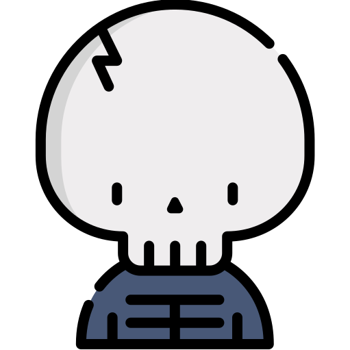

<div align="center">
  
  <br />
  <h1>TinySkeletonJS</h1>
  <blockquote>
  <p>light skeleton compatible with any javascript framework</p>
  </blockquote>
  <br />
  
  
</div>

---

## Installation

`npm install tinyskeletonjs`

## Usage example

[CodePen](https://codepen.io/Pixidreams/pen/mdPBJZL) to play with

## Documentation

- **Override skelton color with** :
```css
:root {
  --skeleton: green; /* green background */
  --skeleton-wave: red; /* wave become red */
}
```
- **Available attributes :**

| attribute | type | default value | usage |
| --------- | ---- | ------------- | ----- |
|  circle | boolean | false | give skeleton a circle shape (need a width) |
| placeholder | string | null | skeleton take text width (work only on one line) |
| width | int | auto | give skeleton a width |
| height | int | auto | give skeleton a height |
| borderRadius | px or % value | 0px | change skeleton borders radius |
| rounded | boolean | false | give a border-radius of 10px |
| lines | int | 0 | numbers of skeleton lines you want to display |

## Meta

<div>Icons made by <a href="https://www.flaticon.com/authors/freepik" title="Freepik">Freepik</a> from <a href="https://www.flaticon.com/" title="Flaticon">www.flaticon.com</a></div>
<br/>

Create a pull issue if you experience any troubles

## Contributing

- Fork it (https://github.com/Pixidream/nerdfox/fork)
- Create your feature branch (git checkout -b feature/fooBar)
- Commit your changes (gitmoji -c')
- Push to the branch (git push origin feature/fooBar)
- Create a new Pull Request
